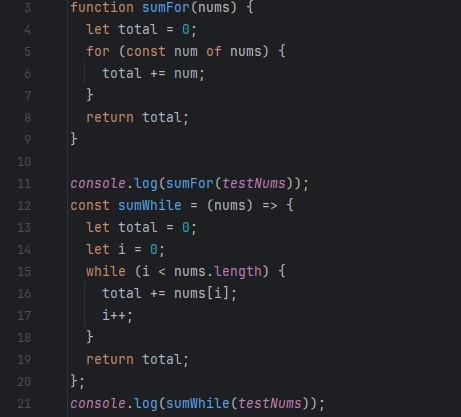

## The Big Picture
When people first think of coding, they often envision the big picture: runtime analysis and algorithm efficiency. What many tend to overlook is the formatting of the code and its appearance to a developer. Much like essays, code can look drastically different depending on which developer wrote it. One way to standardize the appearance and understanding of code is to implement coding standards and practices, such as ESLint. This allows all code to have a standardized appearance that aids any developers who may come across it, enabling them to fully understand and comprehend the expected output and behavior of the methods and functions.

## My Experience 
Ever since ICS 111, I have been told to create clean code and format it in a way that makes it easy to read and understand. However, since this advice came during the adolescence of my programming career, it did not hold much significance for me back then. Now, having matured a bit and gained some experience in coding, I have fully grasped the importance of coding standards and their critical role in a team development setting. In a work environment where there could be hundreds of people working on a given project at a time, and with dozens of engineers working on a code stack, it is vital that everyone follows the company's set coding standards to allow for a smooth workflow within the organization. With that in mind, I find it even more crucial to ensure my code follows ESLint guidelines to allow for these habits to form. Also because my code won't compile properly if I don't fix the ESLint errors. Switching to ESLint turned out to be pretty smooth for me. I already pay a lot of attention to how I write my code, which matches what many people do, so I didn't have to change much. But I did run into a few surprises at the beginning. For instance, I used to add 'else' statements after 'if' statements that ended with a return. With ESLint, I found out that was a no-go. It took me a bit to understand that I didn't really need those 'else' statements because the code inside them would run anyway if the 'if' condition wasn't met. This was a bit of a lightbulb moment for me, teaching me something new about how I could simplify my code. Looking back at my older code, I've also been working on improving the spacing to make everything easier to read. I used to think I was maybe spacing things out too much, but ESLint showed me I wasn't spacing enough. That, and learning about small details like adding a blank line at the end of my files, were easy fixes but really helpful. Most of the ESLint suggestions were about these kinds of small tweaks. Overall, I didn't run into any big issues that stopped me from getting my code to pass ESLint checks. To be honest, setting up ESLint in IntelliJ took up more of my time than fixing the issues it found. Going through this process made me realize how these little changes can make a big difference in making my code cleaner and easier for others and myself to understand later on.

## Final Thoughts

*ChatGPT has been used for grammar and spelling checks*
