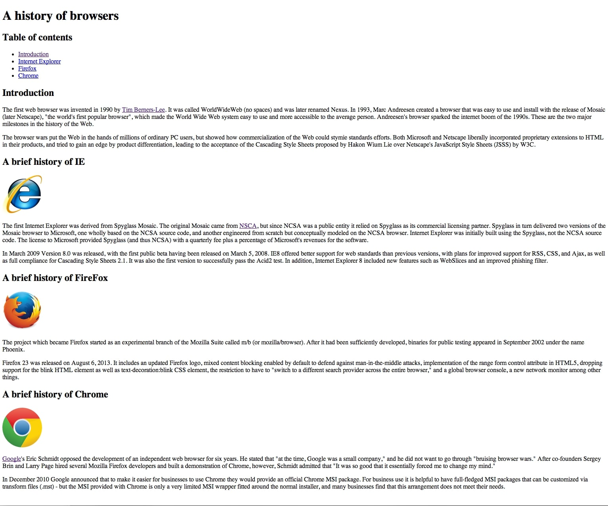
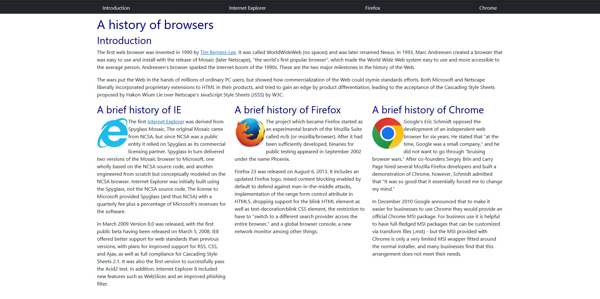

## SquareSpace Supremacy 
  My first interaction with HTML was in middle school when my friends and I played around with the inspect element feature on Chrome, altering anything and everything we could. From changing text on the screen to the colors the webpage displayed, I felt like a computer wizard performing these alterations. At the time, I didn't really understand what I was doing, let alone what HTML even was. All I knew was that by changing a couple of values and text, I could create something cool and special. Now, after doing countless WODs and exercises in HTML, I’ve come full circle with my childhood self. However, with a deeper understanding, I can see how complicated it can get. HTML isn't that difficult on its own. It's when you want to jump out of the '90s website design and create something more unique that you can call yours. The difficulty doesn't lie with HTML, as it's used to just get the info and images onto the page. The real challenge comes with making it all work together—from fonts, color, sizes, borders, text alignment, etc. However, CSS may not have the necessary tools to help you create the image for your website. That’s when Bootstrap comes in and provides an abundant amount of tools and features to aid in this process. But, this doesn’t mean we should throw CSS to the wayside, as it's a fundamental building block in understanding the design of a website and you may never know when it can come back to help you.

## Its all just semantics
  Another toolset that can be used to stylize a web page is Semantic UI. This framework provides several classes that can be added to the HTML and changes the elements they are attached to based on what class they are. These classes can do a plethora of simpler functions. From resizing elements to creating entire menus. Even with all its features, Semantic UI isn't perfect. It's got plenty of options to tweak how things look, but sometimes, it falls short. Take sizing, for instance. Semantic UI lets you pick from a few preset sizes for elements, but what if you're stuck in that awkward spot where "medium" is too small and "large" is too big? I ran into this problem myself when I was trying to get an image to fit just right with some text in a menu. Ended up having to dive into CSS to fine-tune the size. And it's not just size. The color options in Semantic UI are a bit limited too. You've got 12 colors to work with, which sounds great until you need a shade that's not on the list. Again, back to CSS to get that perfect color. Fonts and text styling are another headache. If you're not picky about fonts or text colors, you might not mind. But everything in Semantic UI defaults to the same font, and changing it isn't always straightforward. Like, links are blue right off the bat. Want a different color? Prepare to wrestle with CSS order and specificity. It can get pretty frustrating when your changes don't seem to take effect because your CSS selector wasn't specific enough. After all that, you might start questioning why you went with Semantic UI in the first place if you're just going to end up using CSS for so many tweaks.
As I continue to go through this course and learn new tools and techniques I consider them all to be useful and take pride in any old or new skills learned. I know that one day I may call upon them again to aid me in my never ending journey of becoming an expert software developer.

*ChatGPT has been used for grammar and spell checks*
