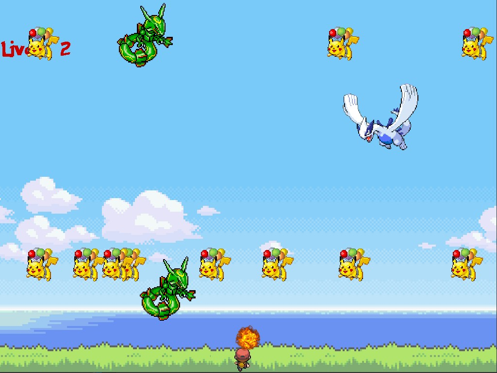

A game that I developed that utilized the EZImage library and sprite manipulation for dynamic player movement. This game allows the player to freely move around the map in an attempt to survive the incoming waves of falling Pokemon. Equipped with a fireball shooter and 3 given lives, they must find the courage to continue on through the onslaught of cute sprite Pokemon.

