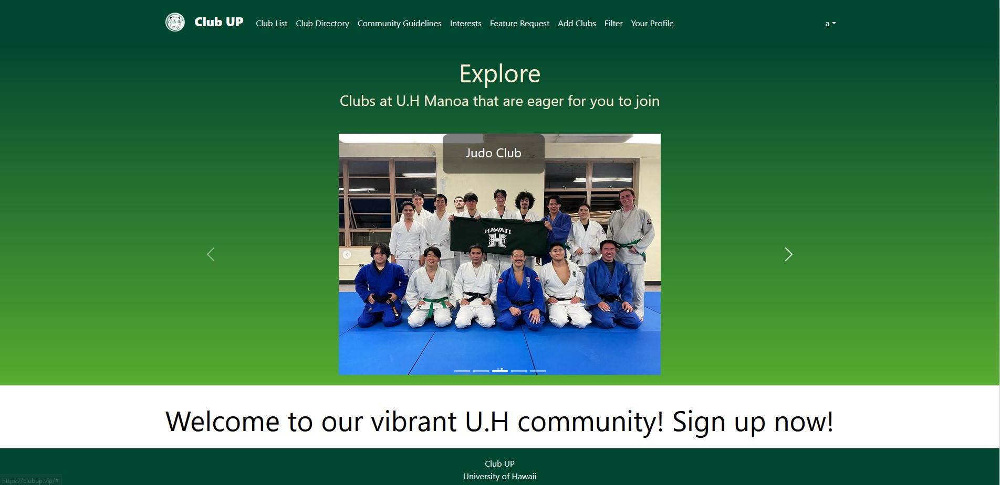
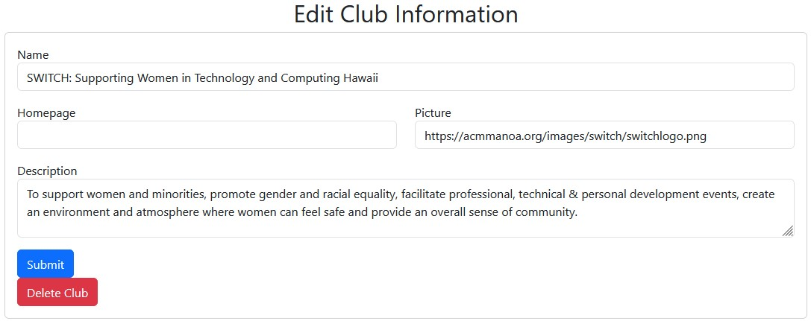

### Introduction

  For our final project, our goal was to create a platform for users to explore and find more information about clubs that align with their interests. We aimed to provide a hub where users could view the UH Manoa catalog of Registered Independent Organizations (RIO) clubs and connect with them, with the hope of joining and fostering a more connected community. To achieve this, we focused on facilitating easy viewing, adding, and deleting of clubs from a user’s profile. 
  
### Design

  At the very beginning, we were ambitious about the features we wanted to implement and the overall design. However, we quickly realized the extensive amount of work required to achieve this vision. As a result, we opted for a simple yet friendly design, with the primary goal of making it easier for users to access the catalog of clubs, and search for and filter clubs according to their interests. 

  

### My Role

  My main role in this project was designing the landing page to provide users with a simple but effective introduction to our website’s main objective, which was to enable browsing of various clubs at UH Manoa. In addition to design implementation, I worked on the functionality of the add, delete, and edit buttons, allowing for the addition of new clubs, the deletion of inactive clubs, and the editing of existing club information to update contact details, club banners, and club biographies.
