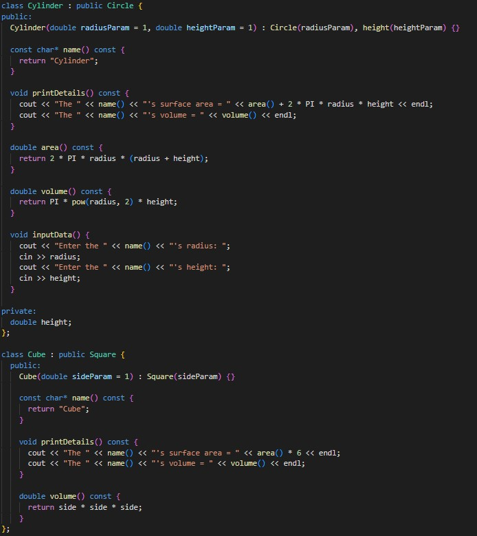

This program establishes a hierarchy of classes for different shapes, including Circle, Square, Sphere, Cylinder, Cube, Triangle, and Tetrahedron. Each class incorporates functions to compute the area and volume of the respective shape. The foundational class, Shape, furnishes virtual functions to retrieve the shape's name, print its details, and collect input data. Every derived class customizes these base class functions to offer their individualized implementations.

